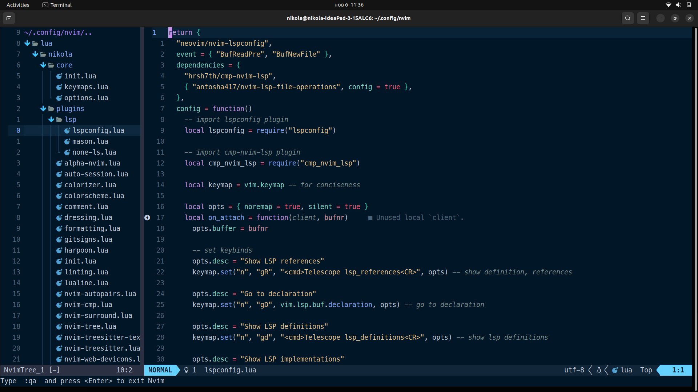

Ovo je moja Neovim konfiguracija:

Plugins:

Plugin Manager

- [folke/lazy.nvim](https://github.com/folke/lazy.nvim) - Amazing plugin manager

  Dependency For Other Plugins

- [nvim-lua/plenary](https://github.com/nvim-lua/plenary) - Useful lua functions other plugins use

  Preferred Colorscheme

- [bluz71/vim-nightfly-guicolors](https://github.com/bluz71/vim-nightfly-guicolors)

  Navigating Between Neovim Windows and Tmux

- [christoomey/vim-tmux-navigator](https://github.com/christoomey/vim-tmux-navigator)

  Essentials

- [vim-scripts/ReplaceWithRegister](https://github.com/vim-scripts/ReplaceWithRegister) - replace things with register with "gr"

  File Explorer

- [nvim-tree/nvim-tree.lua](https://github.com/nvim-tree/nvim-tree.lua)

  VS Code Like Icons

- [kyazdani42/nvim-web-devicons](https://github.com/kyazdani42/nvim-web-devicons)

  Status Line

- [nvim-lualine/lualine.nvim](https://github.com/nvim-lualine/lualine.nvim)

  Fuzzy Finder

- [nvim-telescope/telescope-fzf-native.nvim](https://github.com/nvim-telescope/telescope-fzf-native.nvim) - Dependency for better performance
- [nvim-telescope/telescope.nvim](https://github.com/nvim-telescope/telescope.nvim) - Fuzzy Finder
- [stevearc/dressing.nvim](https://github.com/stevearc/dressing.nvim) - select/input ui improvement

  Marking Files With Prime's Harpoon

- [ThePrimeagen/harpoon](https://github.com/ThePrimeagen/harpoon)

  Autocompletion

- [hrsh7th/nvim-cmp](https://github.com/hrsh7th/nvim-cmp) - Completion plugin
- [hrsh7th/cmp-buffer](https://github.com/hrsh7th/cmp-buffer) - Completion source for text in current buffer
- [hrsh7th/cmp-path](https://github.com/hrsh7th/cmp-path) - Completion source for file system paths
- [onsails/lspkind.nvim](https://github.com/onsails/lspkind.nvim) - Vs Code Like Icons for autocompletion

  Snippets

- [L3MON4D3/LuaSnip](https://github.com/L3MON4D3/LuaSnip) - Snippet engine
- [rafamadriz/friendly-snippets](https://github.com/rafamadriz/friendly-snippets) - Useful snippets for different languages
- [saadparwaiz1/cmp_luasnip](https://github.com/saadparwaiz1/cmp_luasnip) - Completion source for snippet autocomplete

  Managing & Installing Language Servers, Linters & Formatters

- [williamboman/mason.nvim](https://github.com/williamboman/mason.nvim)

  LSP Configuration

- [williamboman/mason-lspconfig.nvim](https://github.com/williamboman/mason-lspconfig.nvim) - Bridges gap b/w mason & lspconfig
- [neovim/nvim-lspconfig](https://github.com/neovim/nvim-lspconfig) - Easy way to configure lsp servers
- [hrsh7th/cmp-nvim-lsp](https://github.com/hrsh7th/cmp-nvim-lsp) - Smart code autocompletion with lsp

  Formatting & Linting

- [stevearc/conform.nvim](https://github.com/stevearc/conform.nvim) - Easy way to configure formatters
- [mfussenegger/nvim-lint](https://github.com/mfussenegger/nvim-lint) - Easy way to configure linters
- [WhoIsSethDaniel/mason-tool-installer.nvim](https://github.com/WhoIsSethDaniel/mason-tool-installer.nvim) - Auto install linters & formatters on startup

  Comments

- [numToStr/Comment.nvim](https://github.com/numToStr/Comment.nvim) - toggle comments with "gc"
- [JoosepAlviste/nvim-ts-context-commentstring](https://github.com/JoosepAlviste/nvim-ts-context-commentstring) - Requires treesitter

  Treesitter Syntax Highlighting, Autoclosing & Text Objects

- [nvim-treesitter/nvim-treesitter](https://github.com/nvim-treesitter/nvim-treesitter) - Treesitter configuration
- [nvim-treesitter/nvim-treesitter-textobjects](https://github.com/nvim-treesitter/nvim-treesitter-textobjects) - Treesitter configuration
- [windwp/nvim-autopairs](https://github.com/windwp/nvim-autopairs) - Autoclose brackets, parens, quotes, etc...
- [windwp/nvim-ts-autotag](https://github.com/windwp/nvim-ts-autotag) - Autoclose tags

  Git

- [lewis6991/gitsigns.nvim](https://github.com/lewis6991/gitsigns.nvim) - Show line modifications on left hand side

The majority of key mappings that i use:

- jk - exit insert mode

- nh - clear search highlight

- space + sv - split window vertically

- space + sh - split window horizontally

- space + se - make split windows equal width and height

- space + sx - close current split window

- gR - show definition, references

- gD - go to declaration

- gd - show lsp definitons

- gi - show lsp implementation

- gt - show lsp type definiton

- space + ca - see available code actions

- space + rn - smart rename

- space + D - show diagnostics for file

- space + d - show diagnostics for line

- [d - jump to previous diagnostic in buffer

- ]d - jump to next diagnostic in buffer

- K - show documentation what is under cursor

- space + rs - mapping to restart lsp if necessary

- space + wr - restore last workspace session for current directory

- space + ws - save workspace session for current working directory

- gcc - comment line

- gc - comment when in visual mode

- space + mp - formatting file

- space + a - Mark file with harpoon

- ctrl + e - toggle harpoon quick menu

- ctrl + v - go to the first harpoon mark

- ctrl + b - go to the second harpoon mark

- ctrl + n - go to the third harpoon mark

- ctrl + m - go to the fourth harpoon mark

- space + hn - go to next harpoon mark

- space + hp - go to previous harpoon mark

- ctrl + h/j/k/l - split window navigation

- space + l - Trigger linting for current file

- ctrl + k - previous suggestion

- ctrl + j - next suggestion

- ctrl + s - show completion suggestions

- ctrl + e - close completion window

- space + ee - toggle file explorer

- space + ef - toggle file explorer on current file

- space + ec - collapse file explorer

- space + er - refresh file explorer

- space + ff - Fuzzy find files in cwd

- space + fr - Fuzzy find recent files

- space + fs - Find string in cwd

- space + fc - Find string under cursor in cwd

- space + sm - Maximize/minimize a split
